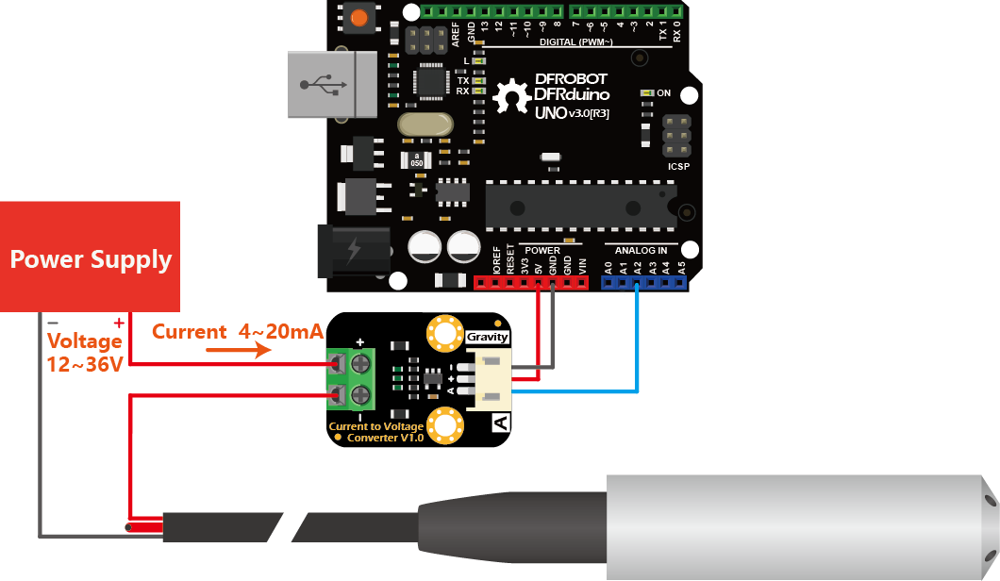

# Liquid Level Transmitter (DFRobot KIT0139)

This repository contains **working Arduino code, wiring diagrams, and sample data readings** for the [DFRobot Throw-in Type Liquid Level Transmitter (KIT0139)](https://wiki.dfrobot.com/Throw-in_Type_Liquid_Level_Transmitter_SKU_KIT0139).

The project demonstrates how to interface the sensor with Arduino, read current/voltage signals, and convert them into meaningful liquid depth measurements.

---

## 📂 Repository Structure

- **`kit0139_code.ino`** – Arduino sketch for reading sensor data  
- **`kit0139_readings.csv`** – Example sensor readings collected during testing  
- **`kit0139_wiring_diagram.png`** – Wiring diagram for hardware setup  

---

## 🔌 Wiring Diagram

Below is the wiring setup for connecting the KIT0139 sensor with an Arduino UNO and a current-to-voltage converter:

---

## 💻 Code Overview

The Arduino sketch demonstrates how to:
- Initialize the analog input  
- Convert sensor output from voltage → current → depth (mm)  
- Print readings over Serial at defined intervals  

Key variables in the code:
- `ANALOG_PIN` → defines which analog pin to read from  
- `RANGE` → depth measuring range (5000 mm for water)  
- `CURRENT_INIT` → offset current at 0 mm  
- `PRINT_INTERVAL` → output frequency (ms)

---
- [DFRobot Wiki – Throw-in Type Liquid Level Transmitter (KIT0139)](https://wiki.dfrobot.com/Throw-in_Type_Liquid_Level_Transmitter_SKU_KIT0139)  
- Arduino documentation: [https://www.arduino.cc/reference/en/](https://www.arduino.cc/reference/en/)
